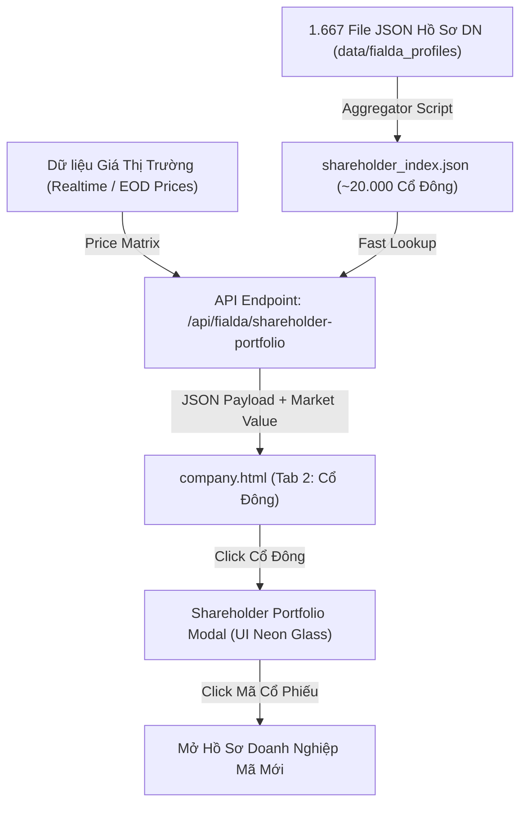

# 📑 KẾ HOẠCH PHÁT TRIỂN: CHI TIẾT CỔ ĐÔNG & DANH MỤC CỔ PHIẾU NẮM GIỮ (PORTFOLIO)
*(Đã cập nhật: Bổ sung tính toán Giá trị tài sản thị trường ước tính)*

Kế hoạch kỹ thuật xây dựng tính năng tra cứu chi tiết cổ đông dựa trên cơ sở dữ liệu **1.667 file JSON** đã trích xuất, cho phép người dùng nhấp vào bất kỳ cổ đông nào để xem danh mục toàn bộ cổ phiếu họ đang nắm giữ trên toàn thị trường Việt Nam cùng **Tổng giá trị tài sản thị trường quy đổi (Tỷ VNĐ)**.

---

## 🎯 Mục Tiêu Nghiệp Vụ & Trải Nghiệm Người Dùng

1. **Tra Cứu Danh Mục Nắm Giữ Xuyên Suốt Thị Trường**:
   - Khi đang xem cổ đông của một công ty (VD: mở `SSI` thấy cổ đông `Norges Bank`, `Nguyễn Duy Hưng`, `Daiwa Securities`), người dùng nhấp chuột vào tên cổ đông sẽ mở ra cửa sổ chi tiết danh mục đầu tư của cổ đông đó.
   - Hiển thị toàn bộ các mã cổ phiếu khác mà cổ đông/tổ chức này đang sở hữu (VD: `Norges Bank` đang nắm giữ 44 mã như `VPB`, `HPG`, `MBB`, `POW`, `STB`, `ACB`, `SSI`...).
2. **💰 Ước Tính Tổng Giá Trị Tài Sản Cổ Phiếu Quy Đổi (Market Value)**:
   - Tự động nhân số lượng cổ phiếu nắm giữ với giá thị trường gần nhất của từng mã để tính ra:
     - **Giá trị từng mã (Tỷ VNĐ)** (VD: 39.8 tr CP HPG $\times$ giá 28.000đ = ~1.116 tỷ VNĐ).
     - **Tổng giá trị khối tài sản cổ phiếu** của cổ đông/quỹ đầu tư đó trên toàn sàn chứng khoán.
3. **Khả Năng Điều Hướng Nhanh (Smart Navigation)**:
   - Trong danh sách cổ phiếu của cổ đông, người dùng có thể nhấp vào bất kỳ mã cổ phiếu nào (`HPG`, `MBB`, `MWG`...) để chuyển ngay sang xem Hồ sơ Doanh nghiệp của mã đó.
4. **Hiệu Năng Tức Thì**:
   - Tốc độ mở danh mục cổ đông $\le$ 0.05 giây nhờ cấu trúc chỉ mục đảo (*Inverted Index*) dựng sẵn từ 1.667 file JSON.

---

## 🏗️ Kiến Trúc Kỹ Thuật



---

## 📋 Chi Tiết Kế Hoạch Triển Khai (3 Giai Đoạn)

### Giai Đoạn 1: Xây Dựng Bộ Chỉ Mục Danh Mục Cổ Đông & Định Giá (Backend Indexer)
1. **Tạo Module Tổng Hợp Chỉ Mục (`build_shareholder_index.py`)**:
   - Quét qua toàn bộ 1.667 file JSON trong `data/fialda_profiles/`.
   - Trích xuất toàn bộ mảng `majorShareholders` và `leaderships`.
   - Nhóm theo định danh Cổ đông (Tên / ID) $\rightarrow$ Danh sách các khoản nắm giữ:
     ```json
     {
       "Norges Bank": {
         "name": "Norges Bank",
         "isIndividual": false,
         "totalHoldings": 44,
         "holdings": [
           { 
             "symbol": "VPB", 
             "companyName": "Ngân hàng Thương mại Cổ phần Việt Nam Thịnh Vượng", 
             "exchange": "HOSE", 
             "shares": 44600000, 
             "ownership": 0.0066, 
             "updatedDate": "2026-06-30" 
           },
           { 
             "symbol": "HPG", 
             "companyName": "CTCP Tập đoàn Hòa Phát", 
             "exchange": "HOSE", 
             "shares": 39886441, 
             "ownership": 0.0069, 
             "updatedDate": "2026-06-30" 
           }
         ]
       }
     }
     ```
   - Lưu kết quả vào `data/shareholder_holdings_index.json` (~20.000 cổ đông).

2. **Tích Hợp Định Giá Thị Trường Vào API Backend (`main.py`)**:
   - Endpoint: `GET /api/fialda/shareholder-portfolio?name={SHAREHOLDER_NAME}&id={ID}`
   - Cơ chế tính toán giá trị:
     - Đọc giá thị trường hiện tại của từng mã từ bảng giá hệ thống (`lastPrice` hoặc `referencePrice`).
     - Tính: `marketValue = shares * currentPrice`.
     - Tính tổng giá trị danh mục: `totalPortfolioValue = SUM(marketValue)`.
     - Tính tỷ trọng giá trị: `weight = marketValue / totalPortfolioValue`.

---

### Giai Đoạn 2: Thiết Kế Giao Diện Danh Mục Cổ Đông & Khối Tài Sản (UI/UX)
1. **Tương Tác Trên Bảng Cổ Đông Lớn (`company.html`)**:
   - Tên cổ đông biến thành liên kết tương tác (`cursor: pointer`, hiệu ứng đổi màu Cyan/Neon khi rê chuột).
   - Thêm huy hiệu hiển thị số lượng cổ phiếu sở hữu (VD: `🏛️ Norges Bank` + `[44 mã CP ↗]`).
2. **Cửa Sổ Popup Chi Tiết Cổ Đông (Portfolio Modal Overlay)**:
   - **Header Cổ Đông & Thẻ KPI Tài Sản**:
     - Avatar/Icon đại diện (👤 Cá nhân / 🏛️ Tổ chức / 🌐 Quỹ ngoại).
     - Tên đầy đủ của cổ đông / tổ chức.
     - 📈 **Tổng số mã nắm giữ**: `44 mã cổ phiếu`
     - 💰 **Tổng giá trị tài sản cổ phiếu ước tính**: `~12.450 Tỷ VNĐ` (Định dạng màu vàng Gold nổi bật)
     - 📊 **Cổ phiếu chiếm tỷ trọng giá trị lớn nhất**: `HPG (~1.116 tỷ VNĐ)`
   - **Thanh Công Cụ Danh Mục**:
     - Ô tìm kiếm nhanh mã/công ty trong danh mục của cổ đông.
     - Lọc theo sàn giao dịch: `Tất cả` | `HOSE` | `HNX` | `UPCOM`.
   - **Bảng Danh Sách Cổ Phiếu Đang Nắm Giữ (Cột Mới)**:
     - `#` (STT)
     - **Mã Chứng Khoán** (Logo tròn 28px + Ticker phát sáng + Tên công ty) $\rightarrow$ *Click mở ngay hồ sơ mã đó*.
     - **Sàn Giao Dịch** (Badge sàn HOSE/HNX/UPCOM).
     - **Số Lượng CP Nắm Giữ** (Định dạng triệu/tỷ CP rõ nét).
     - **Tỷ Lệ Sở Hữu (%)** (Thanh tiến trình trực quan).
     - **💵 Giá Trị Thị Trường Ước Tính (Tỷ VNĐ)** (Cột giá trị quy đổi màu vàng ánh kim).
     - **Tỷ Trọng Danh Mục (%)**.
     - **Ngày Cập Nhật Báo Cáo**.
   - **Biểu Đồ Tròn Cơ Cấu Danh Mục (Portfolio Donut Chart)**:
     - Hiển thị tỷ trọng phân bổ tài sản (% giá trị) giữa các mã cổ phiếu trong danh mục của cổ đông.

---

### Giai Đoạn 3: Kiểm Thử & Tối Ưu Hóa (Verification)
1. **Kiểm tra các cổ đông tiêu biểu**:
   - Quỹ ngoại lớn: `Norges Bank` (44 mã), `Dragon Capital` / `VEIL`, `VinaCapital`, `Daiwa Securities`.
   - Lãnh đạo doanh nghiệp: `Nguyễn Duy Hưng` (11 mã), `Trần Đình Long` (3 mã), `Phạm Nhật Vượng`...
   - Tổ chức nhà nước: `SCIC` (38 mã), `Bộ Quốc phòng` (6 mã)...
2. **Kiểm tra độ chính xác của phép tính giá trị**:
   - Khớp khối lượng $\times$ giá thị trường $\rightarrow$ hiển thị chuẩn theo đơn vị Tỷ VNĐ.
3. **Kiểm tra luồng điều hướng**:
   - Click mã cổ phiếu trong popup $\rightarrow$ Hồ sơ công ty tự động chuyển sang mã đó mượt mà.

---

## 🔒 Trạng Thái

- **Trạng thái:** ĐÃ CẬP NHẬT KẾ HOẠCH HOÀN CHỈNH.
- **Chế độ:** CHƯA TRIỂN KHAI (Đang chờ lệnh từ người dùng).
